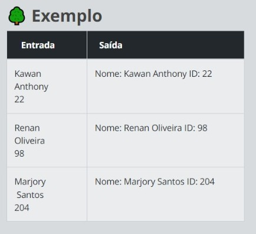
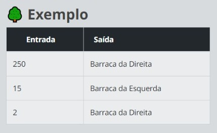
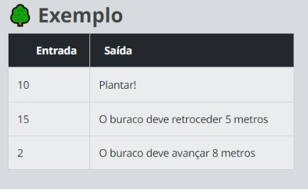

<h1 align="center">🟡🟨Codecamp_Dio🟨🟡</h1>

<p align="center">
Repositório para guardar os códigos desenvolvidos durante o Codecamp oferecido pela Dio!
</p>

<p align="center">
  <a href="#-tecnologias">Tecnologias</a>&nbsp;&nbsp;&nbsp;|&nbsp;&nbsp;&nbsp;
  <a href="#-projeto">Projeto</a>&nbsp;&nbsp;&nbsp;|&nbsp;&nbsp;&nbsp;
  <a href="#-challenges">Challenges</a>
<br>

<p align="center">
  
</p>


>🟡 Projeto em construção

> <strong>Deixa uma estrelinha?🙏⭐</strong>

## 👩‍💻 Tecnologias

<p>
Esse projeto foi desenvolvido com as seguintes tecnologias:

- JavaScript
- Intellij Idea
- Git e Github
</p>

<br>

## 💻 Projeto

Códigos desenvolvidos durante o <strong>Codecamp de JavaScript</strong> oferecido pela DIO.

<br>

# 🥇 Challenges

<h2 align="center">Chegando no Acampamento</h2>
<hr>
<br>

<p>

## 🌱Conhecendo os CleanCoders

Buscando planejar as ações para conter a Oil Corp, um acampamento foi criado e muitos CleanCoders (inclusive novos adeptos da causa) estão chegando. Com isso, para faciliar a comunicação e interação, precisamos imprimir cartões de identificação para todas as pessoas.

Crie um código que com três entradas <strong>(NOME, SOBRENOME e ID)</strong> que imprima essas informações no seguinte padrão: <strong>"Nome: NOME SOBRENOME ID: ID"</strong>

Venilton, um CleanCoder experiente, compartilhou uma dica bem útil. Ele disse que é possível utilizar o conceito de interpolação de strings para facilitar a impressão de textos concatenados à variáveis. Para utilizar basta fazer assim:

```
print(`String e ${variavel}`);
```

</p>

### 🟩🟥 Entradas e Saídas
<p>

As entradas serão: o nome, o sobrenome e o ID de cada CleanCoder. A saída deverá ser essas três variáveis concatenadas em uma única String.
</p>


<p align="center">
  
</p>

<p>
<strong>RESPOSTA: <a href="./desafio1.js">CLIQUE AQUI!</a></strong>
</p>


<hr>
<br>

<p>

## 👐🌳Dividindo Para Preservar
Agora precisamos separar os CleanCoders em dois grupos, isso vai facilitar a execução de ações estratégicas. Para isso, foi definido que os IDs pares devem ir para as barracas à direita da estrada que corta o acampamento e os ímpares para a esquerda. Aproveite essa oportunidade para criar um código que verifique o ID do CleanCoder e indique para onde ele deve ir: <strong>Direita ou Esquerda.</strong>

Um jeito bem fácil de fazermos essa verificação é utilizando o operador %. Com ele conseguimos verificar o resto de divisões.

</p>

### 🟩🟥Entradas e Saídas 
<p>

As entradas serão números inteiros positivos que representarão os IDs dos CleanCoders. A saída deve ser se, de acordo com o ID, o CleanCoder deve ir para as barracas da direita ou da esquerda.
</p>

<p align="center">
  
</p>

<p>
<strong>RESPOSTA: <a href="./desafio2.js">CLIQUE AQUI!</a></strong>
</p>

<hr>
<br>

<p>

## ⛺Plantando o Futuro

Pela manhã, com todos descansados, sua primeira missão será aumentar a plantação de jacarandás, árvore fundamental para a magia do vale. Para isso, é necessário plantá-los a uma certa distância um pé do outro para que nenhuma muda roube o nutriente da outra, fazendo com que algumas não se desenvolvam. Nesse sentido, é necessário que cada pé esteja a exatos 10 metros de distancia um do outro, assim conseguiremos plantar todas as mudas e evitar que algumas não se desenvolvam.

Crie um código que, com as entradas de distancias dos buracos avaliadas pelo drone, verifique se o espaço entre um buraco e outro é igual a <strong>10 metros.</strong> Se for, imprima no console <strong>"Plantar!".</strong> Se não for, imprima no console a distância que o buraco deve <strong>retroceder ou avançar</strong> para chegar ao número ideal.

Para esse desafio os métodos Math do Javascript podem ser muito úteis.

</p>

### 🟩🟥Entradas e Saídas
<p>

As entradas serão quantos metros o drone verificou entre um buraco e outro. A saída deverá ser, dependendo da distância dos buracos analisados pelo drone, se os CleanCoders podem plantar ou se o buraco deve avançar ou retroceder uma quantia X de metros.
</p>

<p align="center">
  
</p>

<p>
<strong>RESPOSTA: <a href="./desafio3.js">CLIQUE AQUI!</a></strong>
</p>


